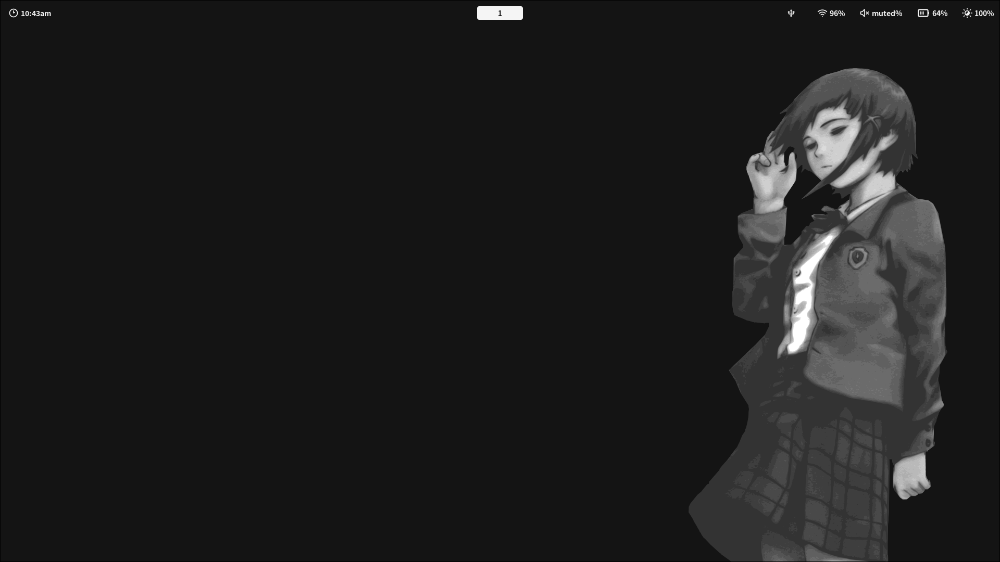

# Dotfiles

### Programs
- kitty (https://github.com/kovidgoyal/kitty)
- zsh (https://www.zsh.org/)
- oh-my-zsh (https://github.com/ohmyzsh/ohmyzsh)
- starship (https://github.com/starship/starship)
- yazi (https://github.com/sxyazi/yazi)
- fastfetch (https://github.com/fastfetch-cli/fastfetch)
- Hyprland (https://github.com/hyprwm/Hyprland)
- eww (https://github.com/elkowar/eww)
- rofi (https://github.com/davatorium/rofi)
- matugen (https://github.com/InioX/matugen)

### Configs
- kitty custom and from https://github.com/mylinuxforwork/dotfiles/blob/main/dotfiles/.config/kitty/kitty.conf
- matugen-themes https://github.com/InioX/matugen-themes
- eww from https://github.com/sudoharun/dotfiles/tree/generic
- zsh and oh-my-zsh custom
- tmux
- fastfetch https://github.com/fastfetch-cli/fastfetch/blob/dev/presets/examples/7.jsonc
- hyprland custom and from https://github.com/mylinuxforwork/dotfiles/tree/main/dotfiles/.config/hypr
- nvim custom
- rofi from https://github.com/mylinuxforwork/dotfiles/tree/main/dotfiles/.config/rofi
- yazi from mathugen-theme
