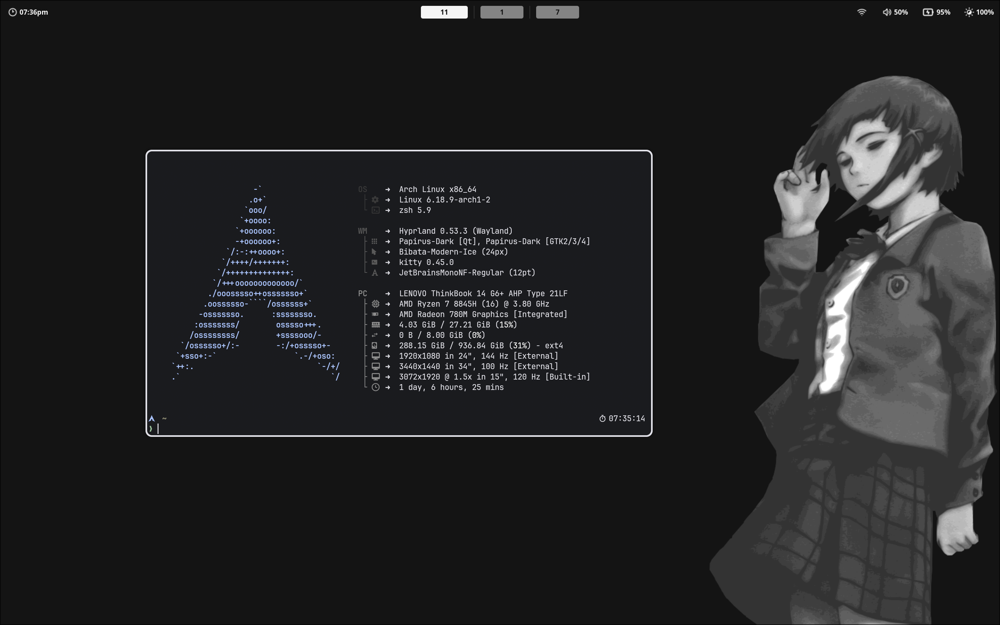

# Dotfiles

### Programs
- [kitty](https://github.com/kovidgoyal/kitty)
- [zsh](https://www.zsh.org/)
- [tmux](https://github.com/tmux/tmux)
- [oh-my-zsh](https://github.com/ohmyzsh/ohmyzsh)
- [starship](https://github.com/starship/starship)
- [yazi](https://github.com/sxyazi/yazi)
- [fastfetch](https://github.com/fastfetch-cli/fastfetch)
- [Hyprland](https://github.com/hyprwm/Hyprland)
- [quickshell](https://quickshell.org/)
- [caelestia-shell](https://github.com/caelestia-dots/shell)
- [matugen](https://github.com/InioX/matugen)
- [sddm](https://github.com/sddm/sddm)

### Configs
- kitty custom and from [mylinuxforwork](https://github.com/mylinuxforwork/dotfiles/blob/main/dotfiles/.config/kitty/kitty.conf)
- [matugen-themes](https://github.com/InioX/matugen-themes)
- zsh and oh-my-zsh custom
- tmux (i forgot)
- [fastfetch](https://github.com/fastfetch-cli/fastfetch/blob/dev/presets/examples/7.jsonc)
- hyprland custom and [mylinuxforwork](https://github.com/mylinuxforwork/dotfiles/tree/main/dotfiles/.config/hypr)
- nvim custom
- yazi from [matugen-themes](https://github.com/InioX/matugen-themes/blob/main/templates/yazi-theme.toml)
- [SilentSDDM](https://github.com/uiriansan/SilentSDDM)

# My Nvim config
[link](https://github.com/Mikhaeris/.dotfiles/tree/main/.config/nvim)
